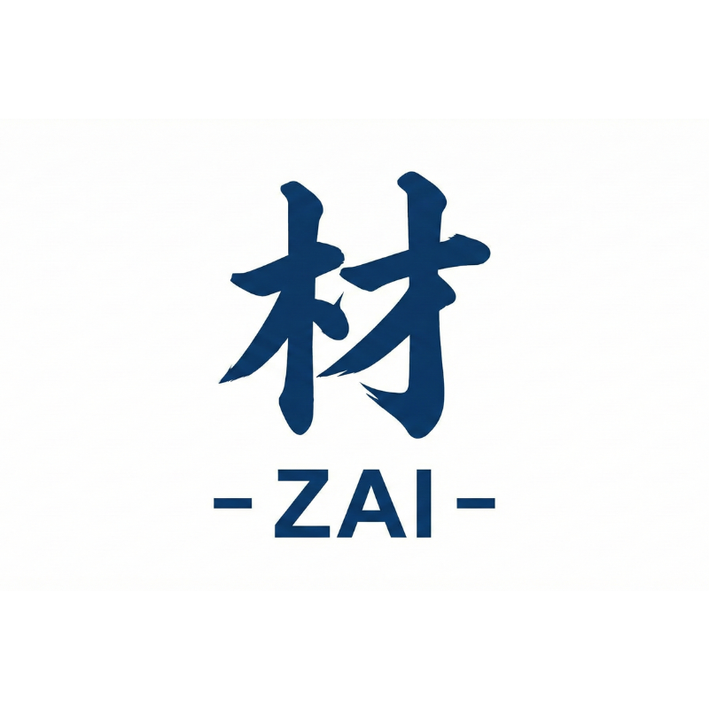
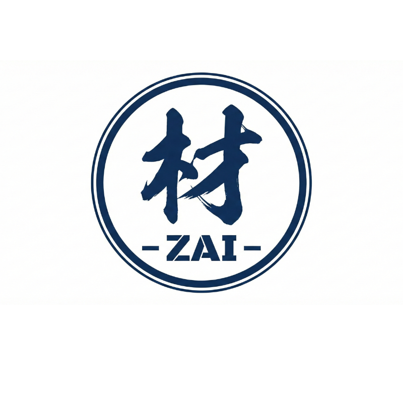
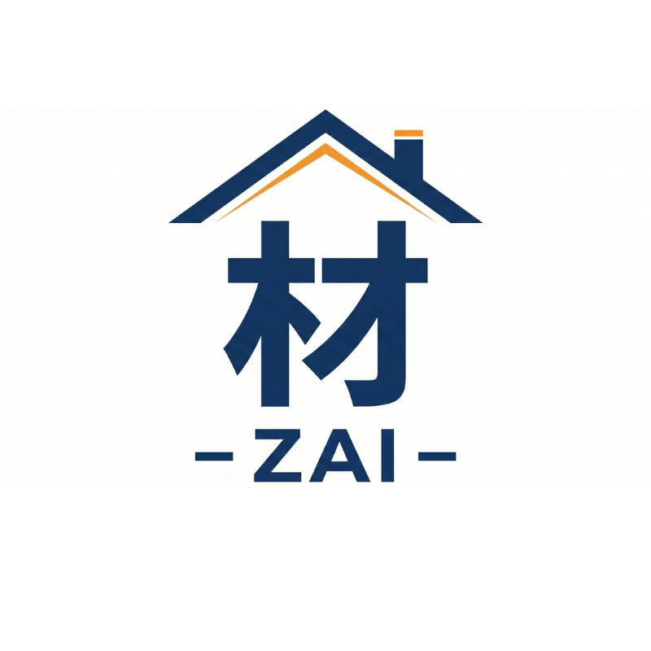
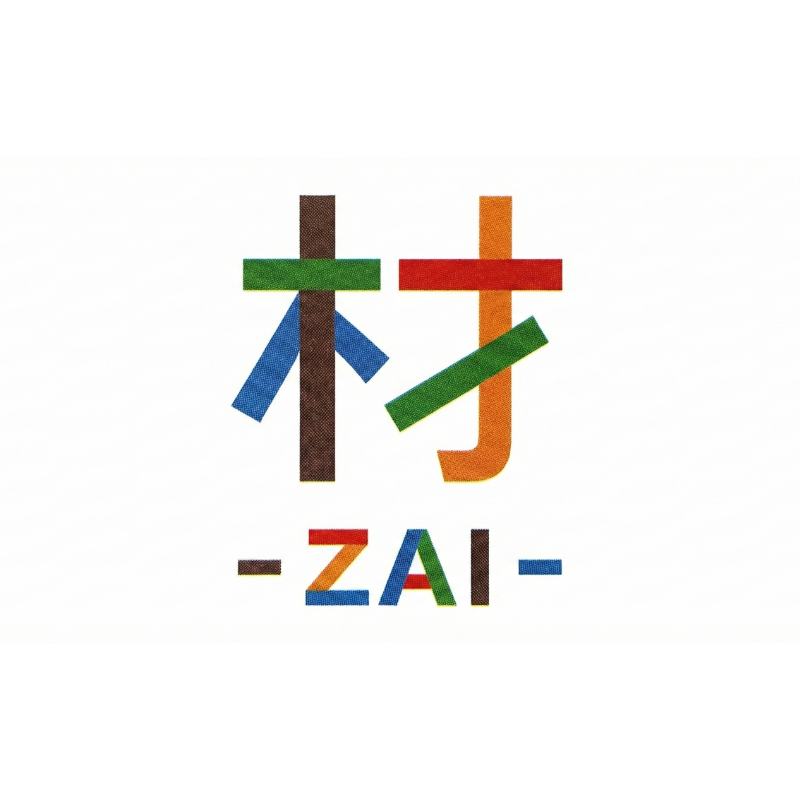

# MYHersMarket ロゴデザイン案

本ページでは、MYHersMarketの世界観を異なる切り口で表現した4つのロゴ案をご提案します。

---

## 案1｜筆文字の「材」

「材」という漢字を筆文字で表現し、家や事業を根底から支える存在としての“素材・人・思想”を象徴しながら、和の力強さと温もりを直感的に伝えることを意図しています。

---

## 案2｜承認印モチーフの「材」

日本的な承認印（判子）の構造をベースに構成し、信頼・安心・確かさを視覚化することで、選ばれるマーケットとしての信頼性を強調する狙いがあります。

---

## 案3｜家を支える「材」

住宅構造における“柱”の概念を重ね、見えない部分で全体を支える存在としての価値を表現し、長く寄り添うブランドであることを伝える設計です。

---

## 案4｜多彩な部材で組んだ「材」

複数の要素を組み合わせた構成により、多様な人・価値・商品が集まり一つの市場を形づくる様子を表現し、MYHersMarketの広がりと柔軟性を象徴しています。
